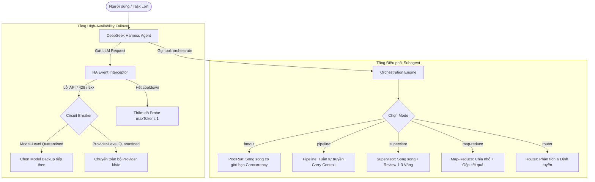

# Nghiên cứu Kiến trúc & Cơ chế hoạt động của `dsh-ha-orchestrator`

> **Nguồn nghiên cứu**: [https://github.com/Saktawdi/dsh-ha-orchestrator](https://github.com/Saktawdi/dsh-ha-orchestrator)  
> **Phiên bản phân tích**: `v0.12.2`  
> **Mục tiêu**: Đánh giá toàn diện kiến trúc, cơ chế HA (High-Availability) Failover, Engine điều phối Subagent và khả năng ứng dụng/học hỏi cho hệ thống Orca ADE Platform.

---

## 1. Tổng quan Dự án (Project Overview)

`dsh-ha-orchestrator` là một **Static Cordis Plugin** (composition row) được thiết kế cho **DeepSeek Harness (`dsh`)** — nền tảng AI Agent Framework của DeepSeek.

Dự án giải quyết 2 bài toán sống còn trong môi trường Autonomous AI Agent chạy tác vụ dài (Long-running Tasks):
1. **Model High-Availability (HA) & Fault-Tolerance**: Tự động chuyển đổi sang mô hình dự phòng (failover) tức thời khi API mô hình chính bị lỗi (Rate limit, 5xx, Timeout, Hết quota, Lỗi xác thực...), có cơ chế ngắt mạch (Circuit Breaker) và tự phục hồi (Probe Recovery).
2. **Subagent Orchestration**: Cung cấp công cụ điều phối thông minh (`orchestrate`) cho phép Agent chính tự động chia nhỏ công việc phức tạp thành các luồng Subagent thực thi song song, tuần tự hoặc thẩm định đa tầng (Fanout, Pipeline, Supervisor, Map-Reduce, Router).



---

## 2. Kiến trúc Kỹ thuật & Thiết kế Module (Architecture & Design Patterns)

Dự án tuân thủ triết lý **Mount-Only / Bundle-Only**: Không chỉnh sửa hoặc can thiệp trực tiếp vào mã nguồn lõi của DeepSeek Harness, mà chỉ tích hợp qua các điểm mở rộng công khai (Public Seams) của framework Cordis.

### 2.1 Cấu trúc Module & Phân tách trách nhiệm

```text
dsh-ha-orchestrator/
├── package.json              # Khai báo dsh.bundle.patch, dsh.client.inject & peerDependencies
├── cordis.patch.yml          # Dòng chèn composition row cho Cordis
├── src/                      # TypeScript Strict Codebase
│   ├── index.ts              # Entry point: Nơi duy nhất giữ ctx, đăng ký tools, events, RPC
│   ├── ha-core.ts            # State machine thuần túy cho HA (Zero-dependency)
│   ├── orch-runner.ts        # Logic thuần túy cho điều phối Subagent & Concurrency Pool
│   ├── config.ts             # Schema, default values & sanitizeConfig
│   ├── language.ts           # Hệ thống i18n đa ngữ (JSON strict, auto fallback)
│   ├── remote.ts             # Polyfill/Mirror layout __esDecorate cho RPC
│   └── types.ts              # Minimal interfaces cho các service của host DSH
├── lib/                      # Build artifacts (tsc output + client.js lazy bundle)
│   └── client.js             # Web UI Settings & Cards cho DSH Dashboard
└── tests/                    # Test suites (143 unit tests độc lập)
```

### 2.2 Các nguyên tắc thiết kế mẫu mực (Key Design Patterns)

1. **Decoupled Pure Logic (Tách biệt Logic nghiệp vụ khỏi Host)**:
   - Các file `ha-core.ts`, `orch-runner.ts`, `config.ts`, `language.ts` hoàn toàn không phụ thuộc vào Cordis hay DSH.
   - Mọi hàm xử lý thời gian đều nhận tham số `now: number = Date.now()` cho phép kiểm thử thời gian (time-travel testing) chính xác 100%.
2. **Dispose Pattern & Lifecycle Cleanliness**:
   - Tất cả listeners, tools, system prompts và RPC methods đều đăng ký qua `ctx.effect`. Khi plugin unload hoặc reload (HMR), toàn bộ tài nguyên tự động dọn sạch, không để lại "zombie listeners".
3. **Contract-based Minimal Service Types**:
   - `types.ts` định nghĩa các interface tối thiểu (`FsService`, `TimerService`, `LlmService`, `SubagentProvider`,...) thay vì import toàn bộ dependency types của DSH (vốn dễ vỡ giữa các bản release candidate).
4. **State Materialization as Service**:
   - Trạng thái HA và cấu hình không chỉ giấu trong closure mà được mở ra thành `ctx.haOrchestrator` RPC service với 19 remote methods phục vụ Web UI và CLI.

---

## 3. Cơ chế High-Availability (HA) & Failover chuyên sâu

Tầng HA can thiệp vào vòng đời gọi mô hình của DeepSeek Harness bằng cách đăng ký ưu tiên cao nhất (`prepend: true`) trên 3 sự kiện:

### 3.1 Vòng đời xử lý lỗi & Phân loại lỗi (Error Classification)

| Loại lỗi | Mã lỗi tiêu biểu | Xử lý của HA |
| :--- | :--- | :--- |
| **Không thể thử lại (Non-retryable)** | `INVALID_CREDENTIAL`, `AUTH`, `UNAUTHORIZED`, `NO_ADAPTER` | **Cách ly ngay lập tức (`quarantine`)** không cần chờ tích lũy số lần lỗi, chuyển sang model backup kế tiếp. |
| **Tràn Context Window** | `CONTEXT_WINDOW_EXCEEDED` | **Không tự động chuyển model** (vì model backup cũng sẽ bị tràn), mà nếu bật `degradeContextWindow` thì hạ `reasoningEffort` để thử lại; nếu không thì nhường quyền cho host nén context (`next()`). |
| **Lỗi tức thời / Quá tải (Retryable)** | `RATE_LIMIT`, `503`, `500`, `TIMEOUT`, `OVERLOADED` | Ghi nhận vào cửa sổ trượt `burstWindowMs`. Nếu số lần lỗi < `threshold` thì backoff retry model hiện tại; nếu $\ge threshold$ thì đưa model vào cách ly (`quarantine`) trong thời gian `cooldownMs`. |

### 3.2 Ngắt mạch 2 tầng (Two-Tier Circuit Breaker)

1. **Tầng Mô hình (Model-Level Circuit)**:
   - Key cách ly: `provider\u0000model`
   - Model bị đánh dấu lỗi sẽ bị bỏ qua trong danh sách quay vòng của tất cả các Agent.
2. **Tầng Nhà cung cấp (Provider-Level Circuit)**:
   - Key cách ly: `provider\u0000*`
   - Khi số lượng model bị lỗi của cùng một provider vượt quá `providerThreshold` (mặc định là 2), hệ thống nhận định provider đó đang sập diện rộng $\rightarrow$ ngắt toàn bộ các model thuộc provider đó.

### 3.3 Cơ chế Thăm dò Phục hồi Siêu Nhẹ (Low-Cost Probe Recovery)

- Khi hết thời gian `cooldownMs`, thay vì đưa model trở lại ngay và có nguy cơ làm hỏng task của user, hệ thống kích hoạt **Active Probe**.
- Gửi 1 request kiểm tra với chi phí tối thiểu: `maxTokens: 1`, prompt `'ping'`.
- **Thành công**: Đóng mạch (`ha/circuit-closed`), đưa model trở lại hoạt động bình thường.
- **Thất bại**: Kéo dài thời gian cách ly thêm một khoảng $\in [60s, 5\text{ phút}]$ và lập lịch probe tiếp theo.

### 3.4 Khôi phục Phiên sau Ngắt quãng (Steer On Stop)

- Khi xảy ra lỗi mô hình làm đứt mạch suy nghĩ của Agent (`agent/error`), hệ thống đợi driver chuyển sang trạng thái nhàn rỗi (idle), sau đó tự động gọi `agent.steer(ha.steerText)`.
- Nhờ vậy, Agent tự động tiếp tục công việc trên model dự phòng mà không cần người dùng phải bấm gõ lại prompt.

---

## 4. Engine Điều phối Subagent (Subagent Orchestration)

Plugin đăng ký công cụ `orchestrate` và `list-subagents` cho phép AI Agent tự động gọi khi gặp tác vụ lớn.

### 4.1 Chi tiết 5 Chế độ Điều phối

```mermaid
flowchart TD
    subgraph Fanout [1. Fanout Mode]
        F_In[Task Lớn] --> F1[Subagent 1] & F2[Subagent 2] & F3[Subagent 3]
        F1 & F2 & F3 --> F_Merge[Merge / Summarize]
    end

    subgraph Pipeline [2. Pipeline Mode]
        P1[Giai đoạn 1] -->|Carry Context| P2[Giai đoạn 2] -->|Carry Context| P3[Giai đoạn 3]
    end

    subgraph Supervisor [3. Supervisor Mode]
        S_In[Task Lớn] --> W1[Worker 1] & W2[Worker 2]
        W1 & W2 --> Reviewer[Reviewer / Subagents]
        Reviewer -->|1-3 Vòng Phản biện| Sup[Supervisor Tổng hợp]
    end

    subgraph MapReduce [4. Map-Reduce Mode]
        M_In[Dữ liệu lớn] --> Map1[Map Worker 1] & Map2[Map Worker 2]
        Map1 & Map2 --> Reducer[Reduce Worker]
    end

    subgraph Router [5. Router Mode]
        R_In[Yêu cầu] --> RouterAgent[Router Subagent]
        RouterAgent --> Choice[Chọn 1 Route tối ưu]
    end
```



1. **`fanout` (Phân tán song song & Gộp)**:
   - Dùng cho: Đọc code các module độc lập, nghiên cứu đối chiếu 3 thư viện cùng lúc.
   - Quản lý qua `poolRun`: Đảm bảo giới hạn số lượng tác vụ đồng thời (`concurrency`), giữ đúng thứ tự kết quả và cách ly lỗi (1 task fail không làm chết các task khác).
2. **`pipeline` (Chuỗi tuần tự tích lũy Context)**:
   - Dùng cho: Quy trình tuần tự (Phân tích $\rightarrow$ Thiết kế API $\rightarrow$ Viết Unit Test $\rightarrow$ Implement).
   - Tự động cộng dồn context đầu ra của bước trước làm ngữ cảnh đầu vào cho bước sau (`appendPipelineCarry`). Hỗ trợ cấu hình `stageRetry`.
3. **`supervisor` (Thực thi & Thẩm định Đa tầng)**:
   - Dùng cho: Tạo tài liệu kỹ thuật quan trọng, kiểm định an ninh hoặc code review khắt khe.
   - Các worker thực thi song song, sau đó chuyển kết quả cho Subagent Supervisor (hoặc hội đồng `reviewers`) phản biện và tổng hợp qua $1 \rightarrow 3$ vòng lặp (`reviewRounds`).
4. **`map-reduce` (Bổ nhỏ & Gom tụ)**:
   - Phù hợp cho phân tích log khối lượng lớn hoặc quét toàn bộ codebase.
5. **`router` (Phân luồng quyết định)**:
   - Giao việc đánh giá điều kiện cho một subagent router chuyên trách để chọn nhánh xử lý.

### 4.2 Tính năng Cao cấp cho Subagent

- **Custom Subagents Profile**: Định nghĩa các vai trò (`reviewer`, `researcher`, `planner`...) với System Prompt, Model và Reasoning Effort riêng biệt.
- **Per-Agent Fallback Chain (`AgentEntry.fallbacks`)**: Mỗi Subagent có thể có danh sách model fallback riêng (ví dụ: Researcher dùng Claude Opus $\rightarrow$ fallback GPT-4o $\rightarrow$ fallback Qwen-Local).
- **Cơ chế Chống Đệ quy & Bùng nổ Chi phí (Non-Proliferation / Depth Control)**:
  - Khống chế trần `maxDepth` (mặc định 0, max 8).
  - Tự động từ chối nếu Subagent cấp dưới cố tình gọi lại `orchestrate` (tránh vòng lặp ngoại bao vô tận).
  - Khống chế ngân sách gọi Agent (`budgetAgents`, max 128).
- **Kiểm soát Công cụ & Output**:
  - `toolFilter`: Whitelist/Blacklist công cụ cho từng Subagent (`tools.allow` / `tools.deny`).
  - `outputSchema`: Ép kiểu đầu ra theo chuẩn JSON Schema (nếu LLM provider hỗ trợ Structured Outputs).
- **Auto-Resume & Fault Recovery**:
  - Lưu trữ nhật ký chạy vào file `dsh-ha-orchestrator.runs.jsonl` và sinh artifact Markdown `dsh-ha-orchestrator.run-<runId>.md`.
  - Tự động phát hiện phiên chạy dở trong vòng 30 phút cùng session để **chạy tiếp các task còn thiếu mà không tốn token chạy lại các task đã hoàn thành**.

---

## 5. Bảng So sánh & Bài học áp dụng cho Orca ADE Platform

Hệ thống của chúng ta (**Orca ADE Platform** trong `CONTEXT.md` và `note.md`) và `dsh-ha-orchestrator` có sự tương đồng rất lớn về tư duy kiến trúc phân tầng:

| Tiêu chí | `dsh-ha-orchestrator` | `Orca ADE Platform` (Hiện tại) | Đề xuất Học hỏi & Tích hợp |
| :--- | :--- | :--- | :--- |
| **Mục tiêu chính** | Plugin HA và chia nhỏ subagents trong DeepSeek Harness. | Nền tảng điều phối đa Agent tự trị toàn diện (Triage $\rightarrow$ Spec $\rightarrow$ Coder $\rightarrow$ Review $\rightarrow$ PR). | Áp dụng mô hình ngắt mạch HA vào tầng Gateway gọi LLM của Orca. |
| **Kiến trúc phân cấp** | Phẳng hoặc nông (`maxDepth <= 2`). Cấm subagent gọi lồng. | **3-Tier Hierarchy (`Depth <= 3`)**: Lead Coordinator $\rightarrow$ Feature Worker $\rightarrow$ Leaf Helper. | Đồng nhất về nguyên tắc Non-Proliferation. Có thể tham khảo cơ chế kiểm tra `session.origin` để chặn triệt để. |
| **Cơ chế Dự phòng (Failover)** | Vòng lặp Round-Robin + 2-Tier Circuit Breaker + Low-cost Probe. | Khai báo các lane tĩnh trong `fleet.json` (`coordinator`, `fast-coder`, `deep-research`). | **Học hỏi**: Thêm cơ chế Circuit Breaker và Active Probe (`maxTokens: 1`) khi một model provider bị nghẽn/rate-limit. |
| **Chế độ Điều phối** | 5 chế độ: Fanout, Pipeline, Supervisor, Map-Reduce, Router. | Phối hợp qua Git Worktrees + Matt Pocock Skills (`/to-spec`, `/implement`, `/tdd`, `/code-review`). | **Học hỏi**: Bổ sung `carry-over context` có cấu trúc giữa các skill và cơ chế `reviewRounds` 1..3 vòng phản biện tự động. |
| **Khả năng Phục hồi (Resume)** | Quét `runs.jsonl` trong 30 phút để tái sử dụng kết quả subtask đã xong. | Quản lý qua Task ID và Git Worktree status. | **Học hỏi**: Tự động cache kết quả subagent task để khi worker bị crash không phải chạy lại toàn bộ từ đầu. |
| **Bảo mật & Cô lập** | Whitelist/Blacklist tools + Structured Output + File sandbox. | Git Worktree cô lập + Relay process tree manager + Safe Research Tripwire. | Tương thích hoàn hảo về tư duy bảo mật cô lập. |

---

## 6. Kết luận & Đánh giá Chung

Repository `Saktawdi/dsh-ha-orchestrator` là một dự án **mã nguồn mở chất lượng cao, thiết kế chuẩn mực**:
1. **Kiến trúc sạch (Clean Architecture)**: Tách biệt hoàn toàn giữa Pure Business Logic và Framework Integration Adapter.
2. **Độ tin cậy cao (High Reliability)**: Xử lý tỉ mỉ mọi trường hợp biên của LLM (Rate-limit, Authentication, Context Exceeded, Zombie listeners).
3. **Cực kỳ an toàn về tài nguyên**: Kiểm soát chặt chẽ concurrency, ngân sách token, độ sâu đệ quy và hỗ trợ khôi phục tiến trình thông minh.

Đây là nguồn tham khảo mẫu mực để nâng cấp tầng **Gateway/Relay Exec** và **Orchestrator Engine** của Orca ADE trong tương lai.
