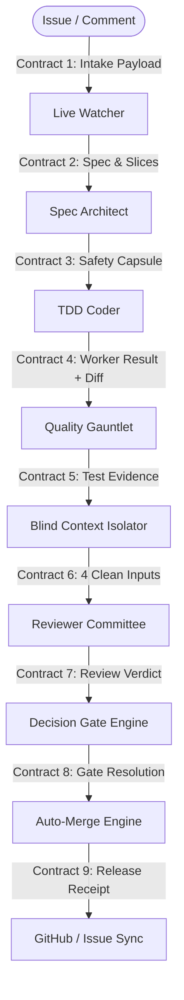
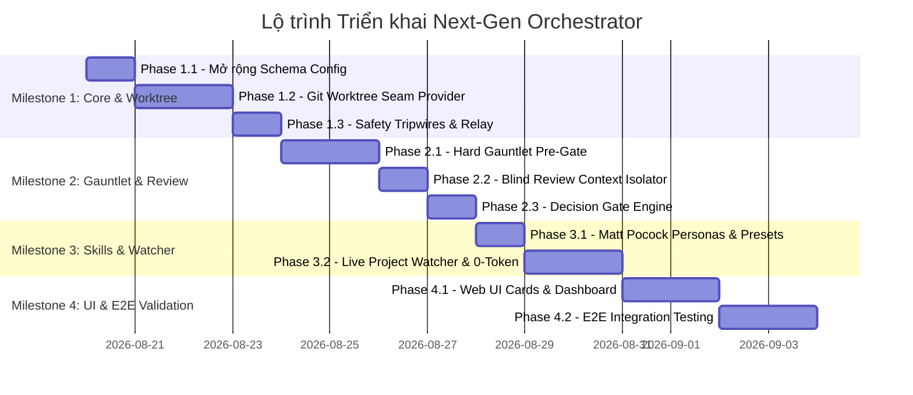

# Sổ tay Nghiên cứu Kiến trúc: Next-Gen Autonomous Orchestrator

> **Mục tiêu**: Hợp nhất tinh túy của **Orca ADE Multi-Agent Platform** (8 nhóm tính năng cốt lõi) vào nền tảng **Cordis Plugin + `dsh-ha-orchestrator`** linh hoạt, dễ tùy biến.  
> **Nguyên tắc làm việc**: Nghiên cứu tới đâu ➔ Ghi chép & Phân tích chi tiết tới đó ➔ Thống nhất Milestone & Phase ➔ Lập Implementation Plan chi tiết.

---

## 1. Bản đồ Nguồn lực & Tài nguyên Hiện có

| Nguồn tài nguyên | Vị trí | Đặc điểm & Giá trị kế thừa |
| :--- | :--- | :--- |
| **`dsh-ha-orchestrator`** | `dsh-ha-orchestrator/` | Lõi HA (Model + Provider Circuit Breaker, Probe, Steer), 5 chế độ Orchestration (`fanout`, `pipeline`, `supervisor`, `map-reduce`, `router`), PoolRun concurrency semaphore, auto-resume 30p, Web UI Settings. |
| **`orca-orchestration`** | `orca-orchestration/` | Chu trình Matt Pocock (`/to-spec`, `/implement`, `/tdd`, `/code-review`), các script kiểm định (`run-gauntlet.sh`, `safe-research.sh`, `relay-exec.mjs`, `verify-premerge.mjs`), cấu hình hạm đội `fleet.json`. |
| **`ref/orca`** | `ref/orca/` | Kho tính năng gốc: Git Worktrees engine, Decision Gates, Scheduled Automations, AI Vault, Linear/GitLab/GitHub trackers, Chromium Design Mode, Mobile Companion (Expo/React Native). |

---

## 2. Hệ thống Hợp đồng Dữ liệu & Giao thức Chuyển giao (Data Contracts & Protocols)

Để đảm bảo toàn bộ hệ thống vận hành trơn tru, không bị sai lệch kiểu dữ liệu (type desync) hay ảo giác (hallucination) giữa các Agent, toàn bộ chu trình được ràng buộc bởi **9 Hợp đồng Chuẩn (Strict Contracts)**:



---

### 📄 Contract 1: Issue & Trigger Intake Contract (`IntakePayload`)
* **Từ**: Live Project Watcher / GitHub / GitLab / CLI
* **Sang**: Lead Coordinator / Orchestrator
* **Cấu trúc dữ liệu**:
```ts
export interface IntakePayload {
  source: 'github' | 'gitlab' | 'manual_prompt' | 'comment_feedback'
  issueId: string | number
  title: string
  body: string
  labels: string[]
  author: string
  baseBranch: string // e.g. "main"
  assuranceTrack: 'Fast' | 'Standard' | 'Full'
  feedbackHistory?: Array<{ author: string; text: string; createdAt: string }>
}
```

---

### 📄 Contract 2: Spec & Task Slices Contract (`SpecAndSlicesPayload`)
* **Từ**: `spec-architect` (`/to-spec`, `/to-tickets`)
* **Sang**: `worktree-runner` & `tdd-coder`
* **Cấu trúc dữ liệu**:
```ts
export interface TaskSlice {
  id: string                   // e.g. "task-auth-01"
  label: string                // e.g. "Implement JWT validator"
  moduleScope: string[]        // Danh sách thư mục/file được phép can thiệp
  prompt: string               // Hướng dẫn TDD chi tiết
  outputHint?: string          // Gợi ý format đầu ra
  outputSchema?: Record<string, unknown> // JSON Schema nếu cần ép kiểu
  tddCriteria: {
    unitTestsRequired: string[] // Tên các test case bắt buộc phải có
    coverageThreshold: number   // Ngưỡng coverage tối thiểu (e.g. 90%)
  }
}

export interface SpecAndSlicesPayload {
  specMarkdown: string         // Nội dung spec.md hoàn chỉnh
  domainGlossary: Record<string, string> // Bảng thuật ngữ Ubiquitous Language
  tasks: TaskSlice[]           // Danh sách các lát cắt để chạy song song (fanout) hoặc tuần tự
}
```

---

### 📄 Contract 3: Worker Safety Capsule Contract (`WorkerSafetyCapsule`)
* **Từ**: Orchestrator Engine
* **Sang**: `tdd-coder` Subagent (Tiêm vào Prompt & Environment)
* **Quy chuẩn tiêm**:
```text
=== 🛡️ WORKER SAFETY CAPSULE ===
ROLE: Finite implementation worker (Depth <= 3).
WORKSPACE_ROOT: /path/to/worktree/agent/task-<id>
ALLOWED_MODULES: [list of files/dirs]
FORBIDDEN_FILES: [.github/**, .env*, secrets/**]
READ_ONLY_SEEDS: [spec.md, CONTEXT.md]
INVARIANT: Follow /tdd strictly (Red -> Green -> Refactor).
CALLBACK_CONTRACT: Return structured JSON with touchedFiles and gitDiff.
================================
```

---

### 📄 Contract 4: Worker Result Contract (`WorkerResultPayload`)
* **Từ**: `tdd-coder` (khi hoàn thành task trong Worktree)
* **Sang**: `gauntlet-runner` & `worktree-merger`
* **Cấu trúc dữ liệu**:
```ts
export interface WorkerResultPayload {
  taskId: string
  status: 'completed' | 'error' | 'max-tokens'
  summary: string             // Markdown tóm tắt những gì đã làm
  worktreePath: string        // Đường dẫn worktree cục bộ
  worktreeBranch: string      // Tên branch (e.g. "agent/task-auth-01")
  touchedFiles: string[]      // Danh sách file thực tế đã sửa/tạo/xóa (từ git status)
  gitDiff: string             // Toàn bộ diff (git diff origin/main...HEAD)
  unitTestsPass: boolean      // Kết quả test mà Coder tự chạy nội bộ
  rawOutput: string           // Log chi tiết
}
```

---

### 📄 Contract 5: Gauntlet Evidence Contract (`GauntletReport`)
* **Từ**: `gauntlet-runner` (Thực thi shell kiểm định thực tế)
* **Sang**: `blind-review-filter` & Reviewers
* **Cấu trúc dữ liệu**:
```ts
export interface GauntletReport {
  timestamp: string
  overallStatus: 'PASS' | 'FAIL'
  linter: {
    passed: boolean
    errorCount: number
    warningCount: number
    rawOutput: string
  }
  typecheck: {
    passed: boolean
    errorCount: number
    errors: string[]
  }
  unitTests: {
    passed: boolean
    total: number
    passedCount: number
    failedCount: number
    durationMs: number
    rawOutput: string
  }
  changedLineCoverage: {
    passed: boolean
    actualPercentage: number
    requiredPercentage: number
    uncoveredLines: Record<string, number[]> // file -> line numbers
  }
  mutationTesting?: { // Stryker (áp dụng cho Full Track)
    passed: boolean
    mutationScore: number
    killed: number
    survived: number
  }
}
```

---

### 📄 Contract 6: Blind Review Input Contract (`BlindReviewPayload`)
* **Từ**: `blind-review-filter` (Sau khi đã lọc sạch toàn bộ chat log)
* **Sang**: `reviewer-standards` & `reviewer-spec`
* **Quy chuẩn 4 Đầu vào Sạch**:
```ts
export interface BlindReviewPayload {
  // ĐẦU VÀO 1: Yêu cầu bài toán
  issue: {
    id: string | number
    title: string
    description: string
  }
  // ĐẦU VÀO 2: Spec kỹ thuật đã duyệt
  approvedSpec: string // Nội dung spec.md
  // ĐẦU VÀO 3: Mã nguồn thay đổi thực tế
  codeChanges: {
    touchedFiles: string[]
    gitDiff: string
  }
  // ĐẦU VÀO 4: Bằng chứng kiểm thử thực tế
  evidence: GauntletReport
}
```

---

### 📄 Contract 7: Reviewer Verdict & Consensus Contract (`ReviewVerdictPayload`)
* **Từ**: Các Reviewer Subagents
* **Sang**: `decision-gate-engine`
* **Cấu trúc dữ liệu**:
```ts
export interface ReviewVerdictPayload {
  reviewerName: string       // "reviewer-standards" | "reviewer-spec"
  round: number              // 1, 2 hoặc 3
  vote: 'PASS' | 'REJECT' | 'PATCH_IN_PLACE'
  verdictMarkdown: string    // Phân tích chi tiết theo 2 trục
  findings: Array<{
    severity: 'BLOCKER' | 'MAJOR' | 'MINOR' | 'NIT'
    file: string
    line?: number
    description: string
    suggestedFix?: string
  }>
  quickPatch?: {             // Dành cho lỗi nhỏ <= 5 dòng có thể tự vá tại chỗ
    file: string
    patchDiff: string
  }
}
```

---

### 📄 Contract 8: Decision Gate Contract (`DecisionGatePayload`)
* **Từ**: `decision-gate-engine`
* **Sang**: Web UI / RPC / Slash Command & Auto-Merge Engine
* **Cấu trúc dữ liệu**:
```ts
export interface DecisionGatePayload {
  gateId: string             // e.g. "gate_run_8f9a2b"
  runId: string
  assuranceTrack: 'Standard' | 'Full'
  status: 'pending' | 'approved' | 'rejected' | 'auto_resolved'
  createdAt: string
  consensusSummary: {
    standardsPass: boolean
    specPass: boolean
    gauntletPass: boolean
    consensusReached: boolean
  }
  diffStats: {
    filesCount: number
    insertions: number
    deletions: number
  }
  resolution?: {
    approvedBy: 'human_user' | '3_agent_committee'
    resolvedAt: string
    comment?: string
  }
}
```

---

### 📄 Contract 9: Release & State Reconciliation Contract (`ReleaseReceipt`)
* **Từ**: `auto-merge-engine`
* **Sang**: Remote GitHub/GitLab & Audit Log
* **Cấu trúc dữ liệu**:
```ts
export interface ReleaseReceipt {
  issueId: string | number
  pullRequest: {
    number: number
    url: string
    title: string
    mergedAt: string
    mergeCommitSha: string
  }
  labelsUpdated: {
    added: string[]          // e.g. ["done"]
    removed: string[]        // e.g. ["in-progress", "ready-for-human"]
  }
  worktreesCleaned: string[] // Danh sách các worktree đã xóa an toàn
  artifactsPath: string      // File markdown tổng kết run-*.md
  status: 'SUCCESS' | 'FAILED_PREMERGE'
}
```

---

## 3. Nhật ký Nghiên cứu & Quyết định Kiến trúc (Architectural Decisions)

### ✅ Chủ đề 1: Cơ chế Cô lập Workspace & Git Worktree (ĐÃ CHỐT)
* Phân luồng 3 Track (`Fast/Standard/Full`).
* Quy tắc Vàng: **Integrate-Before-Cleanup** cho 5-6 Coder chạy song song.
* Hợp đồng kết quả: Trả về Báo cáo + `touchedFiles` + `gitDiff`.

### ✅ Chủ đề 2: Quality Gauntlet & Giao thức Thẩm định Mù (Blind Review) (ĐÃ CHỐT)
* Quy trình lọc 2 tầng: Hard Gauntlet Pre-Gate $\rightarrow$ Blind Adversarial Review (4 đầu vào sạch).
* Bounded Failure Ladder (tự vá $\le 5$ dòng, nảy lại tối đa 2 lần).
* Review 2 trục (Standards + Spec) qua 1..3 vòng phản biện.

### ✅ Chủ đề 3: An toàn, Tripwires & Khống chế Phân cấp (ĐÃ CHỐT)
* Khống chế 3-Tier (`Depth <= 3`) qua `isSubagentAgent` và `orch.maxDepth`.
* Safe Research: Tự động gán `tools.deny` ghi file khi `readOnly: true`.
* Quét `orch.forbiddenPaths` trước khi cho phép merge.
* Relay Exec: `tree-kill` chống tiến trình zombie khi timeout hoặc abort.

### ✅ Chủ đề 4: Cơ chế Decision Gates & Phê Duyệt Đồng Thuận (ĐÃ CHỐT)
* `Standard Track`: 3 Agent tự bỏ phiếu đồng thuận, tự vá lỗi nhỏ.
* `Full Track`: Mở Decision Gate tạm dừng `waiting_gate` chờ người dùng duyệt trên Web UI / RPC / Slash command.

### ✅ Chủ đề 5: Live Watcher & Tự động Bắt Sự kiện (ĐÃ CHỐT)
* Background Watcher với 0-token probe: Bắt Issue mới, Comment mới, thay đổi nhãn/trạng thái.
* Đồng bộ hai chiều nguyên tử (Atomic 2-way State Sync) với GitHub/GitLab.

### ✅ Chủ đề 6: Đóng gói Skills Matt Pocock (ĐÃ CHỐT)
* 5 Personas chuẩn (`spec-architect`, `tdd-coder`, `reviewer-standards`, `reviewer-spec`, `system-diagnostician`).
* 3 Presets 1-Click (`mattpocock-full-tdd`, `blind-code-review`, `root-cause-diagnosis`).

---

## 4. Bản đồ Milestone & Phân kỳ Triển khai (Milestones & Phases Roadmap)



### 🎯 MILESTONE 1: Nền tảng Core Engine, Git Worktree & An toàn
* **Phase 1.1 (Mở rộng Schema & Config)**: Bổ sung cấu hình `forbiddenPaths`, `worktreeRoot`, `automation`, và cờ `readOnly` cho Personas vào `src/config.ts`.
* **Phase 1.2 (Git Worktree Seam Provider)**: Xây dựng `src/worktree-runner.ts` tự động cấp Worktree độc lập theo Track (`Fast/Standard/Full`), thu thập `touchedFiles` & `gitDiff`, cài đặt quy tắc **Integrate-Before-Cleanup** cho 5-6 worker song song. Đăng ký bộ công cụ `worktree_*` vào `ctx.tools`.
* **Phase 1.3 (Safety Tripwires & Relay Execution)**: Tự động gắn `tools.deny` ghi file khi `readOnly: true`, tích hợp cơ chế `tree-kill` chống tiến trình zombie, và quét `forbiddenPaths` trước khi merge.

---

### 🎯 MILESTONE 2: Quality Gauntlet, Thẩm định Mù & Decision Gates
* **Phase 2.1 (Hard Gauntlet Pre-Gate)**: Xây dựng `src/gauntlet-runner.ts` thực thi shell test thực tế (Linter + Coverage + Stryker Mutation Testing), tích hợp **Bounded Failure Ladder** (tự vá lỗi nhỏ $\le 5$ dòng, nảy lại Coder tối đa 2 lần).
* **Phase 2.2 (Blind Review Context Isolator)**: Trích xuất context sạch trong `src/orch-runner.ts`, chỉ bơm 4 đầu vào sạch (Issue, Spec, Diff, Gauntlet Evidence) cho hội đồng Reviewer 2 trục (Standards + Spec) qua 1..3 vòng phản biện.
* **Phase 2.3 (Decision Gate Engine)**: Xây dựng trạng thái `waiting_gate` cho `Full Track`, phát sự kiện `orch/gate-opened` lên UI và cung cấp RPC `orchGateResolve` + slash command `/orchestrate gate approve <id>`.

---

### 🎯 MILESTONE 3: Chu trình Tự trị Matt Pocock & Live Project Watcher
* **Phase 3.1 (Đóng gói Personas & Presets)**: Cấu hình sẵn 5 Personas (`spec-architect`, `tdd-coder`, `reviewer-standards`, `reviewer-spec`, `system-diagnostician`) và 3 Presets 1-Click (`mattpocock-full-tdd`, `blind-code-review`, `root-cause-diagnosis`).
* **Phase 3.2 (Live Project Watcher & 0-Token Probe)**: Xây dựng `src/project-watcher.ts` chạy nền quét Issue mới, Comment mới, thay đổi nhãn với 0-token probe; tự động đánh thức Agent kích hoạt pipeline và sync 2 chiều nhãn Issue.

---

### 🎯 MILESTONE 4: Giao diện Web UI & Kiểm thử Tích hợp Toàn diện
* **Phase 4.1 (Web UI Dashboard)**: Cập nhật `lib/client.js` hiển thị thẻ Decision Gate tương tác (xem Diff, Gauntlet Report, nút Approve/Reject), quản lý Worktree song song và trạng thái Live Watcher.
* **Phase 4.2 (Kiểm thử E2E & Verify)**: Viết unit tests và integration tests giả lập toàn bộ vòng đời tự trị từ lúc Issue mới xuất hiện đến lúc Auto-Merge thành công. Đảm bảo chạy pass 100% `scripts/verify.mjs`.

---
